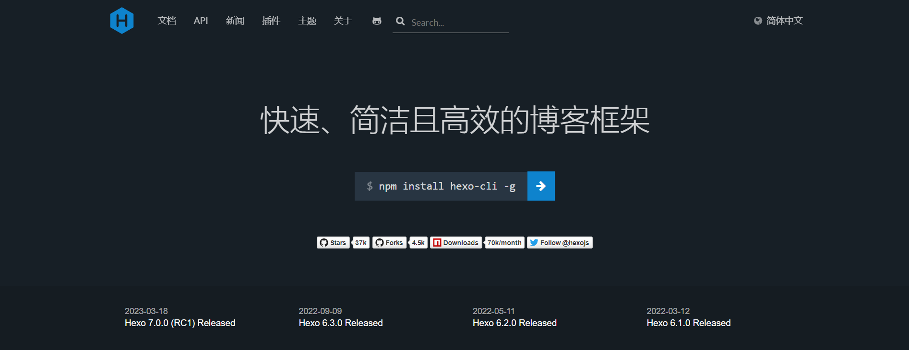
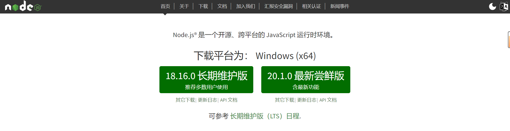
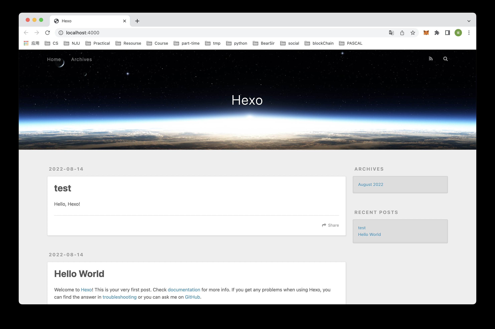
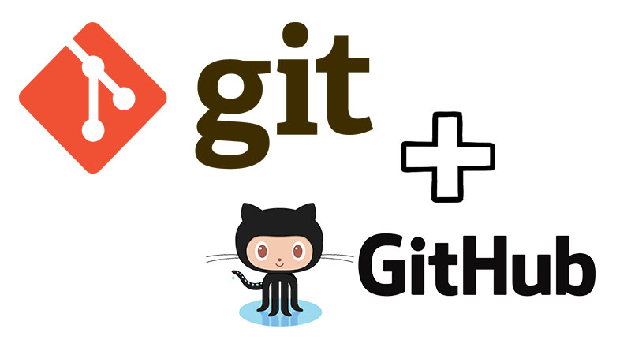
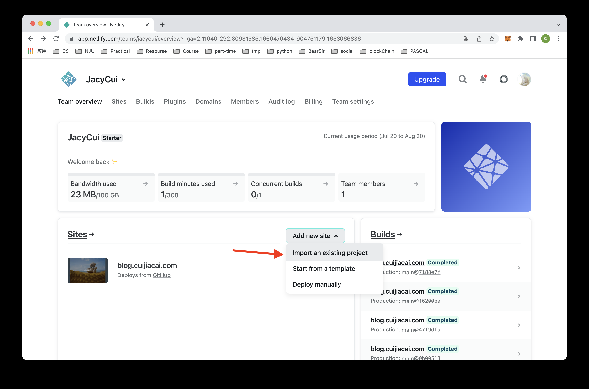
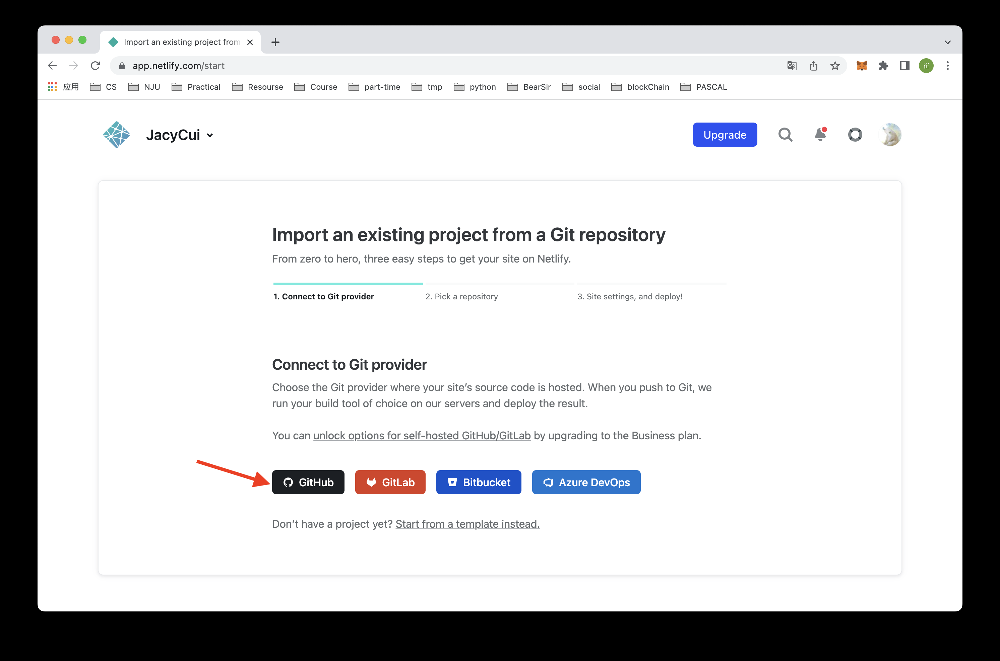
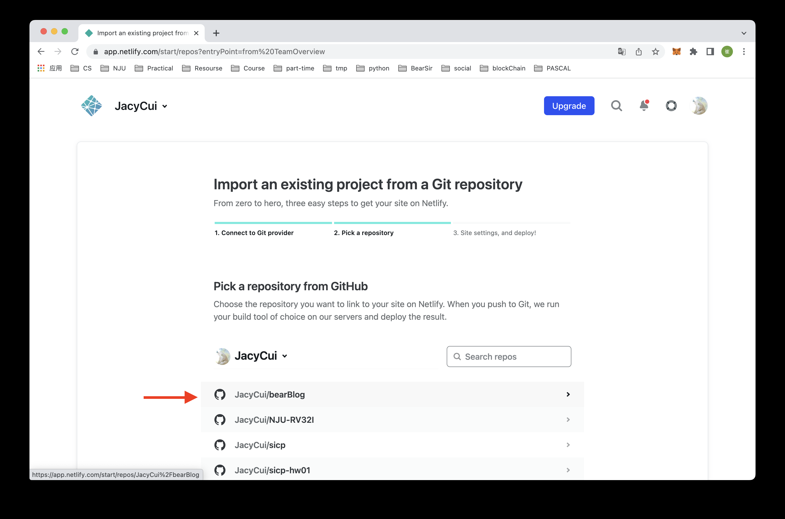
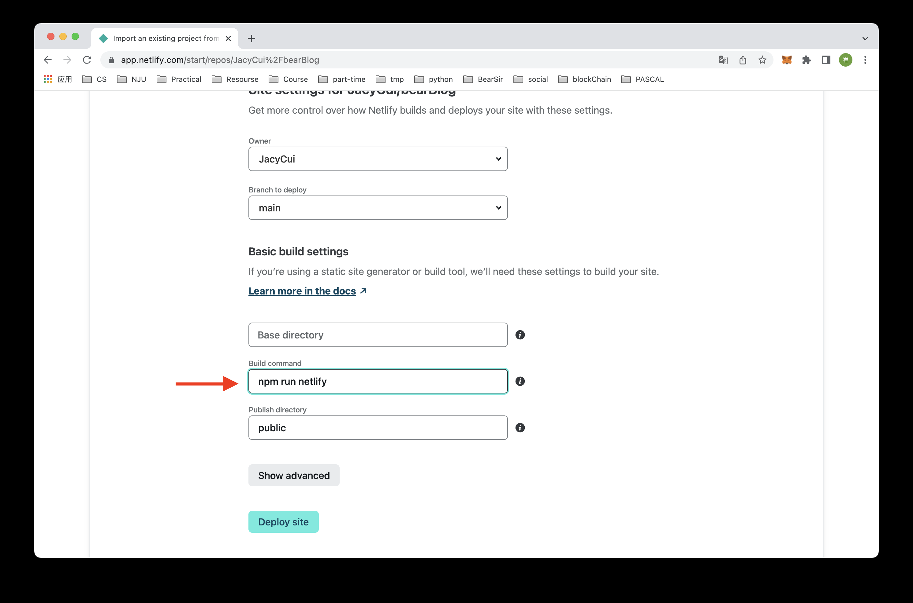
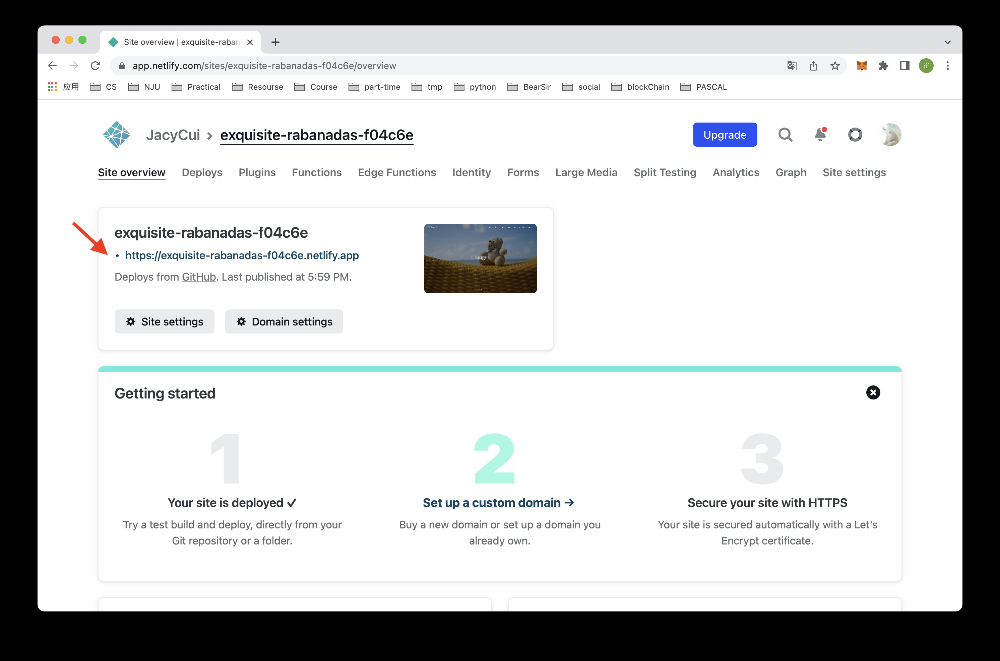

##引言
该文章是个人博客的创建的叙述,旨在为想要创建个人博客的友友们提供一些方法和思绪并且记录一下自己博客的搭建过程方便日后进行回顾

####写博客的好处
有道是"学而不思则罔,思而不学则殆",对于自己学到的东西如果没有经常回忆和复习就容易遗忘。所以通过博客作为载体,记录下平时学习到的东西,不仅可以帮助自己时常温习并进行技术上的一些沉淀,而且通过文章的传播也有助于知识的分享。

####使用工具以及环境
这个教程使用的博客框架是hexo,博客文件托管在github,博客网站通过netlify生成,国内访问通过cloudflare进行cdn加速,使用该解决方案的原因是不需要使用云服务器,也不需要备案,只需要一个域名。

##hexo博客框架
####介绍
 
hexo是一个基于nodejs的静态博客网站生成器，作者是来自台湾的Tommy Chen，为许多技术博客的博主所青睐，主要有如下的一些优点：

- 支持`Markdown`语法，编辑简单，排版优美；
- 能够快速生成静态html文件；
- 部署容易，接口简单；
- 社区主题、插件很多，遇到问题的时候能查到的参考材料也很多。

####环境配置
搭建hexo需要依靠**Nodejs**的环境,可以到[官网下载](https://nodejs.org/zh-cn)


查看版本信息以及环境配置信息
``` bash
node -v # 查看node版本信息
npm -v # 查看npm版本信息
```

能够正常看到版本信息则说明安装正常

####生成博客
#####安装
有了npm包管理工具,便可以很方便安装hexo,只需要一行命令
``` bash
npm install hexo-cli -g # 全局安装hexo命令行工具
```
其中-g参数表示全局安装，没有这个参数就只在当前目录下安装，建议全局安装。

#####初始化
运行命令：
```  bash
hexo init "你的博客目录名称" # 目录名称不含空格的时候双引号可以省略
```

然后进入博客目录：
```  bash
cd "博客目录"
```

安装博客需要的其他支持：
```  bash
npm install # 安装的依赖项在package.json文件的dependencies字段中可以看到
```

#####博客目录介绍
各部分的含义：

- _config.yml
  - 为全局配置文件，网站的很多信息都在这里配置，比如说网站名称，副标题，描述，作者，语言，主题等等。具体可以参考官方文档：https://hexo.io/zh-cn/docs/configuration.html。
- scaffolds
  - 骨架文件，是生成新页面或者新博客的模版。可以根据需求编辑，当hexo生成新博客的时候，会用这里面的模版进行初始化。
- source
  - 这个文件夹下面存放的是网站的markdown源文件，里面有一个_post文件夹，所有的.md博客文件都会存放在这个文件夹下。现在，你应该能看到里面有一个hello-world.md文件。
- themes
  - 网站主题目录，hexo有非常丰富的主题支持，主题目录会存放在这个目录下面。
我们后续会以默认主题来演示，更多的主题参见：https://hexo.io/themes/

#####生成新文章
``` bash
hexo new post "test" # 会在 source/_posts/ 目录下生成文件 ‘test.md’，打开编辑
hexo generate        # 生成静态HTML文件到 /public 文件夹中
hexo server          # 本地运行server服务预览，打开 http://localhost:4000 即可预览你的博客
```

本地预览效果：

这是hexo的默认主题，更多的主题可以从官网下载。

更详细的hexo命令可以查看文档：https://hexo.io/zh-cn/docs/commands

#####添加建站脚本
为了后续netlify建站方便，我们可以在package.json里面添加一个命令：
``` json
{
    // ......
    "scripts": {
        "build": "hexo generate",
        "clean": "hexo clean",
        "deploy": "hexo deploy",
        "server": "hexo server",
        "netlify": "npm run clean && npm run build" // 这一行为新加
    },
    // ......
}
```

#####博客配置
这里简单提一下_config.yml的各个字段的含义：
``` yaml
# Site
title: Hexo  # 网站标题
subtitle:    # 网站副标题
description: # 网站描述
author: John Doe  # 作者
language:    # 语言
timezone:    # 网站时区, Hexo默认使用您电脑的时区

# URL
## If your site is put in a subdirectory, set url as 'http://yoursite.com/child'
## and root as '/child/'
url: http://yoursite.com   # 你的站点Url
root: /                    # 站点的根目录
permalink: :year/:month/:day/:title/   # 文章的 永久链接 格式   
permalink_defaults:        # 永久链接中各部分的默认值

# Directory   
source_dir: source     # 资源文件夹，这个文件夹用来存放内容
public_dir: public     # 公共文件夹，这个文件夹用于存放生成的站点文件。
tag_dir: tags          # 标签文件夹     
archive_dir: archives  # 归档文件夹
category_dir: categories     # 分类文件夹
code_dir: downloads/code     # Include code 文件夹
i18n_dir: :lang              # 国际化（i18n）文件夹
skip_render:                 # 跳过指定文件的渲染，您可使用 glob 表达式来匹配路径。    

# Writing
new_post_name: :title.md  # 新文章的文件名称
default_layout: post      # 预设布局
titlecase: false          # 把标题转换为 title case
external_link: true       # 在新标签中打开链接
filename_case: 0          # 把文件名称转换为 (1) 小写或 (2) 大写
render_drafts: false      # 是否显示草稿
post_asset_folder: false  # 是否启动 Asset 文件夹
relative_link: false      # 把链接改为与根目录的相对位址    
future: true              # 显示未来的文章
highlight:                # 内容中代码块的设置    
  enable: true            # 开启代码块高亮
  line_number: true       # 显示行数
  auto_detect: false      # 如果未指定语言，则启用自动检测
  tab_replace:            # 用 n 个空格替换 tabs；如果值为空，则不会替换 tabs

# Category & Tag
default_category: uncategorized
category_map:       # 分类别名
tag_map:            # 标签别名

# Date / Time format
## Hexo uses Moment.js to parse and display date
## You can customize the date format as defined in
## http://momentjs.com/docs/#/displaying/format/
date_format: YYYY-MM-DD     # 日期格式
time_format: HH:mm:ss       # 时间格式    

# Pagination
## Set per_page to 0 to disable pagination
per_page: 10           # 分页数量
pagination_dir: page   # 分页目录

# Extensions
## Plugins: https://hexo.io/plugins/
## Themes: https://hexo.io/themes/
theme: landscape   # 主题名称

# Deployment
## Docs: https://hexo.io/docs/deployment.html
#  部署部分的设置
deploy:     
  type: '' # 类型，常用的git 
```

####Github代码托管

创建本地仓库，然后推送到远端服务器即可：
``` bash
cd "博客目录"
git init
git add .
git commit -m "my blog first commit"
git remote add origin "远端github仓库地址"
git branch -M main
git push -u origin main
```

####Netlify建站
#####介绍
Netlify是一个国外的免费的提供静态网站部署服务的平台，能够将托管 GitHub，GitLab 等上的静态网站部署上线。至于我们为什么不使用**github**自带的**gitpage**，原因很简单，访问速度慢。

#####建站步骤
1.首先注册并登陆[Netlify](https://www.netlify.com/)
   - 这一步需要能够科学上网，因为这是一个国外的网站
   - 我们的博客在开启cloundflare的CDN加速之前，也只能通过科学上网的方式访问
  
2.新建站点： 
   

3.连接github：


4.选择刚刚上传的博客项目：


5.一切默认，除了构建命令改成我们之前设置的npm run netlify：


```
这里BaseDirectory为空表示项目目录是仓库目录的根目录。
```

6.构建完成后我们就能够看到一个URL，打开网址就是我们的个人博客了


可以根据提示进行进一步的设置，比如说设置一下二级域名（即netlify.app之前的域名）。

在下面的演示中，我设置的netlify二级域名为blogbearsir，也就是说，我的个人博客站点的域名为blogbearsir.netlify.app。